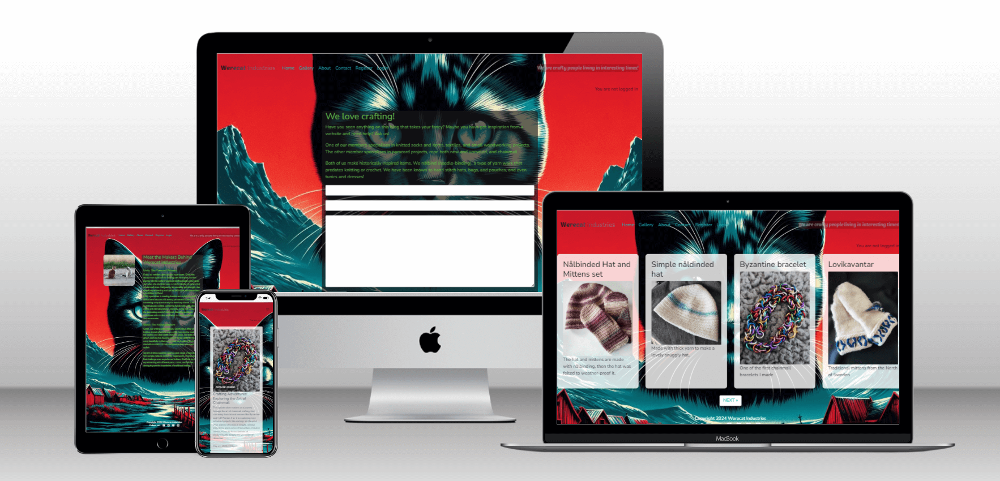

# Werecat Industries Blog
## Portfolio Project 4 - Fullstack Dev course taught by Code Institute

## [Link to live site](https://werecat-blog-46217e65417f.herokuapp.com/)

### This is Portfolio Project 4 for Full Stack Developer Diploma taught through Code Insititute.

## Purpose

The idea behind this website was to design a blog for a couple of crafty people that want to take things to the next level.

## Design

The client wanted a 'blog' so they could keep their community upto date with their project, any courses they may want to expand into, interesting events and information.  The second ask was for a 'contact form' so that people could contact them.  The third thing they wanted was an 'about me' page to introduce themselves to the world.  And finally they wanted a 'gallery' to show off.

They requested a vibrant cyberpunk colour scheme, when questioned about a preference for background image versus a solid colour, they said they had been playing with AI image generation and would love to have a background image using the colour scheme discused, and AI image generation.  We had a play with several generators while we were discussing things, and had a play with prompts.  After several tries we settled on this image:

The client loved it, and we were asked to proceed.

## UX - layout

### Home Page

This is the first page you see when opening the site, it has a responsive design so that it displays differently for different sized screens, the version shown here is for an ipad.

#### Navbar

It has a fully functional navbar:

Large screen version

Small screen version

You can see that there is an admin button on the right hand side, this allows a user logged in as Admin can access the admin panel directly from the home page.  There is a 'sign out' link, that will be display as follows:

You will recieve a message once you succesfully log out:

After succesfully signing out the sign out button is replaced with a 'register' and 'sign in' link.  If either of these options is clicked you it will re-direct you to the appropiate screen.

The register link opens to show this page, shown here for ipads:

The sign-in link opens to show the following page:

The same page for a smaller mobile screen:

After succesfully registering or signing in there will be a message shown to notify you, I have only shown a single version here:

#### Body of the page

Under the navbar we find the section with the blog posts, these are displayed in a card form that will open the post completely when the title of the post is clicked.  Each card shows a header image, that is by default, the same one shown at the top of the ReadMe, however there is an option to add images to the post to override this.

Blog post opened up for reading in a mobile phone sized screen:

Same post but for an ipad sized screen:

Finally at the bottom of the page the clients wanted a link to social media so that users have an easy way to connect.

### Gallery

The gallery page, it has a responsive design so that it displays differently for different sized screens, the version shown here is for an ipad.  It is a very simple, straight forward design, looking very similar to the home page, but with more cards per page. -- Late into the project the client said they wanted the gallery to auto populate from the blog posts, after discussions we decided to have that as their "stretch goal" and I will work on it after the initial release. --

This is a screenshot of the gallery from an ipad:

### About

The about page, it has a responsive design so that it displays differently for different sized screens, the version shown here is for larger screens, in this case the laptop the project was designed and coded on.  It is a very simple design, with an image supplied by the client, however there is a default image available as well.  The text is styled to follow the clients colour palette and other design choices.

### Contact

The about page, it has a responsive design so that it displays differently for different sized screens, __________________________
It's a simple form, the client didn't want anything to complicated, three fields, name, email, and message.  It does what the client wants and allows both registered users and site visitors to contact the client.

### Admin

The Admin panel is one of the most important parts of this site, it is where the clients will be able to enter their posts, and images, monitor user registrations, check any contact requests and reply as needed, monitor and approve or delete comments.

## Development

Using a database for this project meant I needed a way to track interactions of database items, to achieve this I used Entity Relationship Diagrams, if I hadn't tracked these things I would have got lost while trying to ensure everything was interacting correctly.

These are the two I have as digital the rest I have scrawled on my notepads:

The 'About' section erd

The 'blog entry' section erd

As part of this process I used a kanban board to monitor user stories, and ensure I complete everything the client wanted, with the exception of the 'stretch goals'.  Shown below is a screenshot of the kanban board I created for this project.

## Technologies

This is a list of technologies I used while building this site:
***
* Django Framework - version 4.2.13
* Django allauth - version 0.57.2
* Django Crispy forms - version 2.1
* Django Jazzmin - version 3.0.0
* Django Summernote - version 0.8.20.0
* gunicorn - version 20.1.0
* psycopg2 - version 2.9.9
* cloudinary - version 1.36.0
* whitenoise - version 5.3.0
* Bootstrap - version 5.3.x
* pip - version 24.0
* python - for the functionality of the inside gubins of the website.
* HTML  - to accomplish the structure of the website.
* CSS - to style the website.
* Javascript - for the functionality of the user visable website.
* Git - to provide version control (to commit and push code to the repository). 
* Gitpod - IDE to develop the website.
* Github - To host the source code.
* Swewi's kanban board - To monitor user stories and track.
* Heroku - Used to deploy the project.
* Google Dev Tools - For page inspection and checking website.
* Code Institute's Gitpod Template - to generate the workspace for the project.
* Mural - to make the ERD's for database interactions.
* [Lorem Ipsum](https://loremipsum.io/) - Creating initial content to check pagination.
* ElephantSQL - to host the postgres database.

This is a list of technologies I used to design this website:
***
* [TechSini](https://techsini.com/multi-mockup/) To create mockup image.
* [TinyJPG](https://tinyjpg.com/) To compress images.
* [FontAwesome](https://fontawesome.com/) Icons.
* [Goggle Fonts](https://fonts.google.com/) For website fonts.
* [Favicon](https://favicon.io/) To create favicon for the website.
* [Open art AI](https://openart.ai/home) To create the background image.
* [ChatGPT](https://chat.openai.com/) used for spell checking, grammar, readability, and creating blog posts.
* My own photo's.

This is a list of technologies I used to manually test both the code and the accessability:
***
* [Colorfilter](https://www.toptal.com/designers/colorfilter/) to check website for colour-blind accessibility.
* [NVDA screen reader](https://www.nvaccess.org/) to access screen reader capabilities on website.
* Google Chrome's [Lighthouse](https://developer.chrome.com/docs/lighthouse/overview/) to check accessibility.
* [W3C HTML Markup Validator](https://validator.w3.org/) to check HTML code.
* [W3C Jigsaw CSS Validator](https://jigsaw.w3.org/css-validator/) to check CSS code.

## Testing

I carried out both manual and automatic testing for this project.

### Manual testing

HTML - I used the w3 validator to check the HTML code, while this produced a number of 'errors' they were all relating to having python code integrated into the HTML, I was using the validator to check for any errors I may have introduced through spelling, syntax.  None of the templates I checked had any issues.
CSS - I used the css validator to check the stylesheet.  There were no errors.
Javascript - The errors that came up were warnings about character count.

### Automatic testing

There are test files for every app, when they are run there are no issues.
* In order to run these tests do the following:
* - Within the terminal type > **python manage.py test**
* - hit enter

### Accessibility testing

In order to test the accessibility of the site I run the site through the following tests:
***
* Colourblind testing:
* - [Red/Green - red cone based](https://www.toptal.com/designers/colorfilter?orig_uri=https://werecat-blog-46217e65417f.herokuapp.com/&process_type=protan)
* - [Red/Green - green cone based](https://www.toptal.com/designers/colorfilter?orig_uri=https://werecat-blog-46217e65417f.herokuapp.com/&process_type=deutan)
* - [Blue/Yellow - blue cone based](https://www.toptal.com/designers/colorfilter?orig_uri=https://werecat-blog-46217e65417f.herokuapp.com/&process_type=tritan)
* - [Greyscale](https://www.toptal.com/designers/colorfilter?orig_uri=https://werecat-blog-46217e65417f.herokuapp.com/&process_type=grey)
* NVDA screen reader: While using this app I had no problem understanding what was being said.
* Aria/Alt: Used throughout the site to maximise readabilty by screen readers.

#### Lighthouse output
I ran lighthouse to check the overall accessibility rating of website, the results below are for both a desktop and a mobile device:

##### Desktop

##### Mobile

Overall the accessibilitiy of the site is good.

### Browser testing

I have tested the website on four different browsers:
* Google Chrome
    - I have opened every page from every other page, all the links worked.
    - I have used dev-tools to test image links and alt tags, all showed correctly.
    - I have tested all the links on the external links page, making sure they conected correctly, all links worked correctly.

* Opera GX
    - I have opened every page from every other page, all the links worked.
    - I have used dev-tools to test image links and alt tags, all showed correctly.
    - I have tested all the links on the external links page, making sure they conected correectly, all links worked correctly.

* Firefox
    - I have opened every page from every other page, all the links worked.
    - I have used dev-tools to test image links and alt tags, all showed correctly.
    - I have tested all the links on the external links page, making sure they conected correectly, all links worked correctly.

* Edge
    - I have opened every page from every other page, all the links worked.
    - I have used dev-tools to test image links and alt tags, all showed correctly.
    - I have tested all the links on the external links page, making sure they conected correectly, all links worked correctly.

