# Werecat Industries Blog

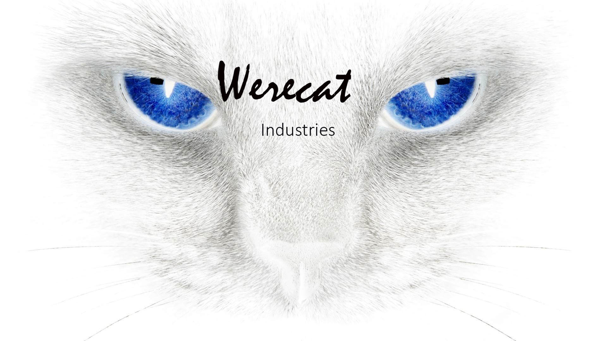

## Portfolio Project 4 - Fullstack Dev course taught by Code Institute

## [Link to live site](https://werecat-blog-46217e65417f.herokuapp.com/)

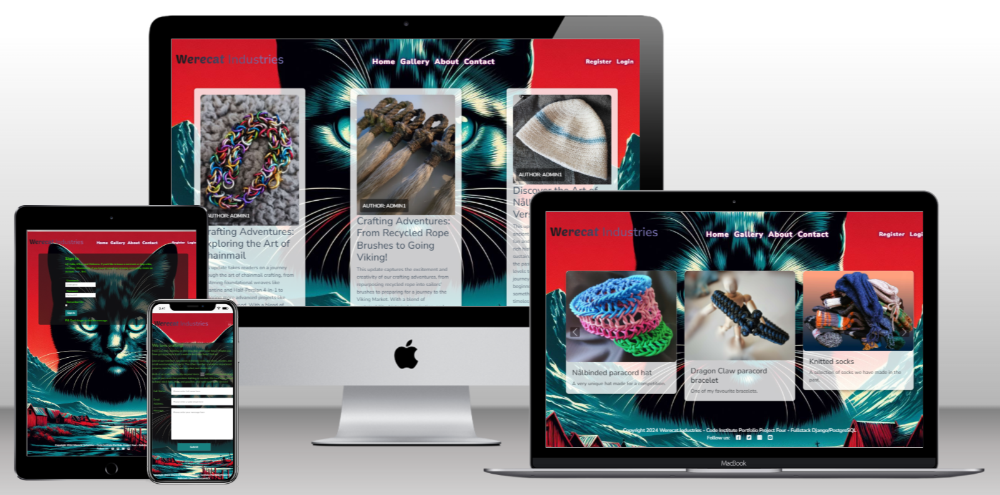

### This is Portfolio Project 4 for Full Stack Developer Diploma taught through Code Insititute

## Purpose

The idea behind this website was to design a blog for a couple of crafty people that want to take things to the next level.

## Design

The client wanted a 'blog' so they could keep their community upto date with their project, any courses they may want to expand into, interesting events and information.  The second ask was for a 'contact form' so that people could contact them.  The third thing they wanted was an 'about me' page to introduce themselves to the world.  And finally they wanted a 'gallery' to show off.

They requested a vibrant cyberpunk colour scheme, when questioned about a preference for background image versus a solid colour, they said they had been playing with AI image generation and would love to have a background image using the colour scheme discused, and AI image generation, but could we also have a solid colour for any overflow.  We had a play with several generators while we were discussing things, and had a play with prompts.  After several tries we settled on this image:

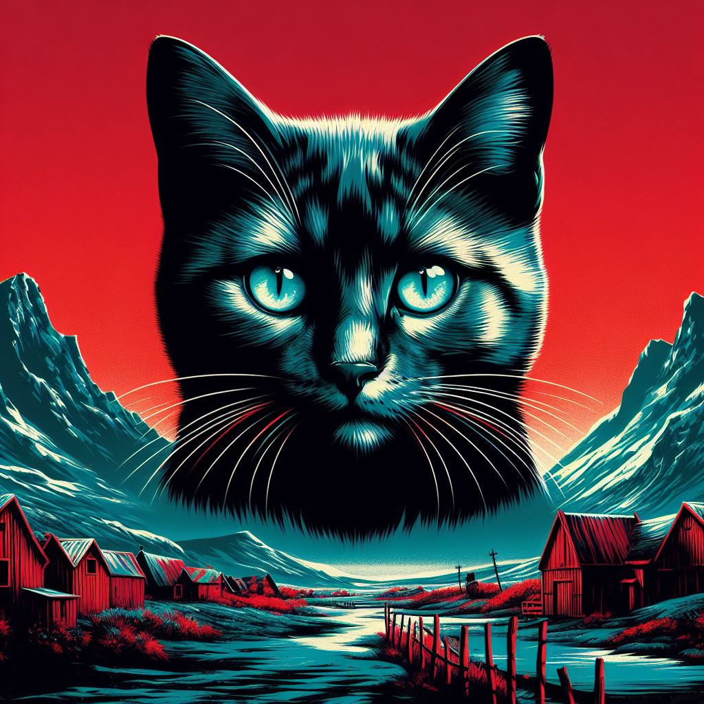

The client loved it, and we were asked to proceed.

## UX - layout

### Home Page

This is the first page you see when opening the site, it has a responsive design so that it displays differently for different sized screens, the version shown here is for an ipad.

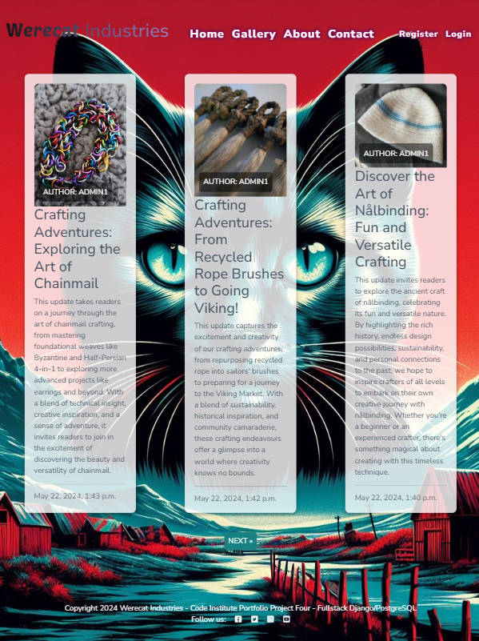

#### Navbar

It has a fully functional navbar:

Large screen version

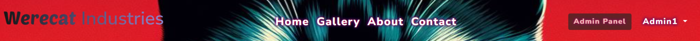

Small screen version

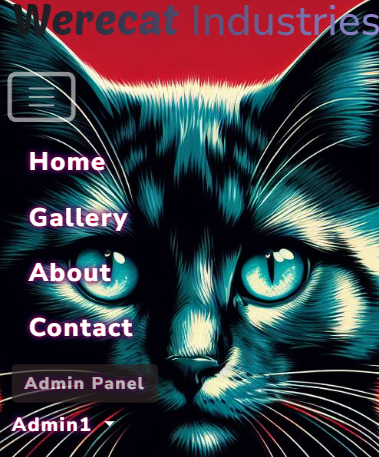

You can see that there is an admin button on the right hand side, this allows a user logged in as Admin can access the admin panel directly from the home page.  There is a 'sign out' link, that will be display as follows:

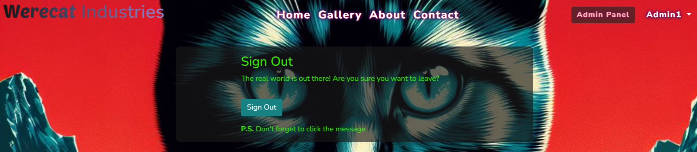

You will recieve a message once you succesfully log out:

After succesfully signing out the sign out button is replaced with a 'register' and 'sign in' link.  If either of these options is clicked you it will re-direct you to the appropiate screen.

The register link opens to show this page, shown here for ipads:

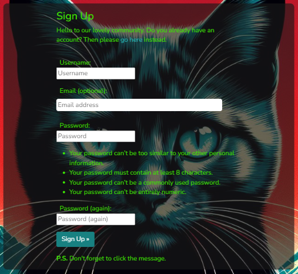

The sign-in link opens to show the following page:

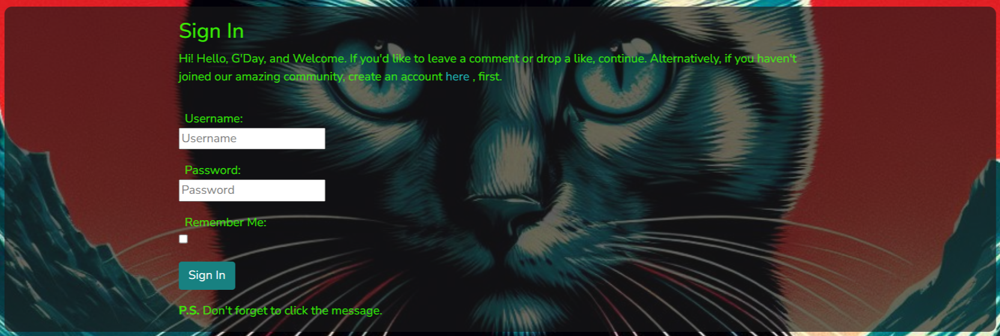

The same page for a smaller mobile screen:

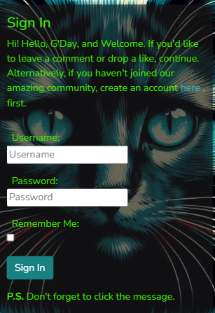

After succesfully registering or signing in there will be a message shown to notify you, I have only shown a single version here:

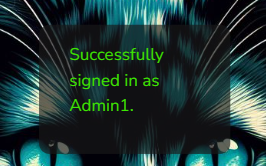

#### Body of the page

Under the navbar we find the section with the blog posts, these are displayed in a card form that will open the post completely when the title of the post is clicked.  Each card shows a header image, that is by default, the same one shown at the top of the ReadMe, however there is an option to add images to the post to override this.

Blog post opened up for reading in a mobile phone sized screen:

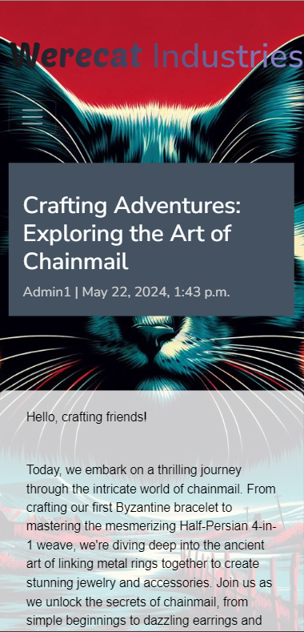

Same post but for an ipad sized screen:

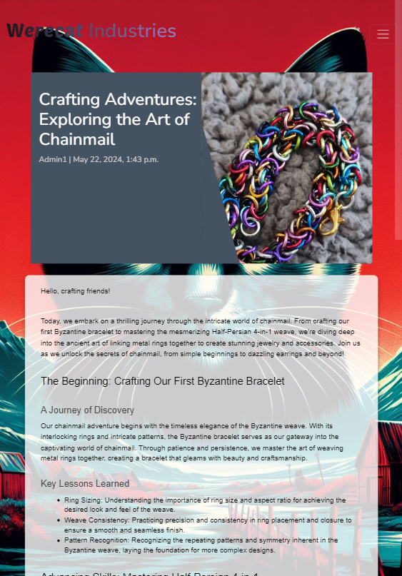

Finally at the bottom of the page the clients wanted a link to social media so that users have an easy way to connect.

### Gallery

The **Gallery page**, it has a responsive design so that it displays differently for different sized screens, the version shown here is for an ipad.  It is a very simple, straight forward design, looking very similar to the home page, but with more cards per page. -- Late into the project the client said they wanted the gallery to auto populate from the blog posts, after discussions we decided to have that as a "stretch goal" and I will work on it after the initial release. --

This is a screenshot of the gallery from an ipad:

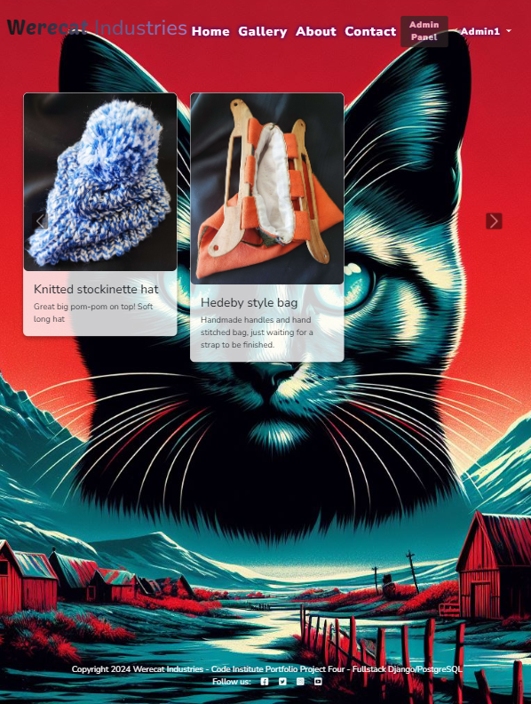

### About

The **About page**, it has a responsive design so that it displays differently for different sized screens, the version shown here is for larger screens, in this case the laptop the project was designed and coded on.  It is a very simple design, with an image supplied by the client, however there is a default image available as well.  The text is styled to follow the clients colour palette and other design choices.

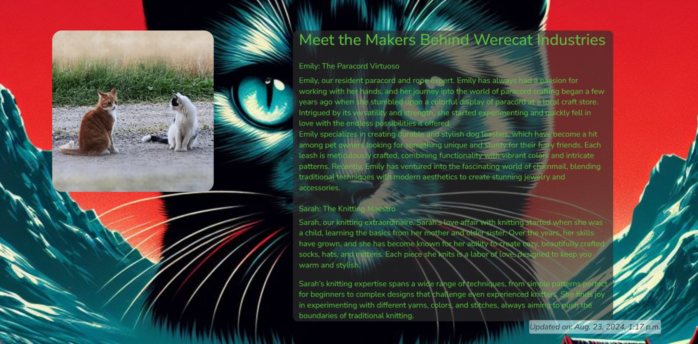

### Contact

The **Contact page**, it has a responsive design so that it displays differently for different sized screens.  It's a straight forward form, the client didn't want anything to complicated, three fields, name, email, and message.  It does what the client wants and allows both registered users and site visitors to contact the client.

This is the contact page shown on a small mobile screen:

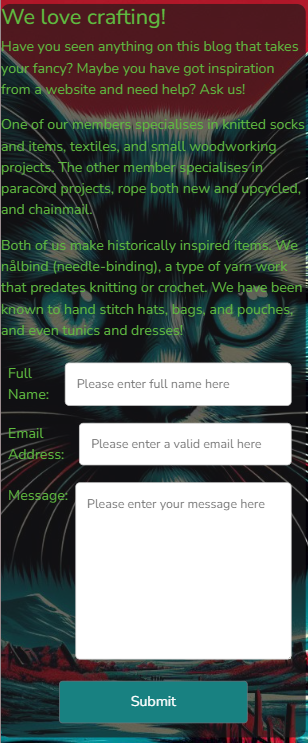

This is the contact page shown on an ipad:

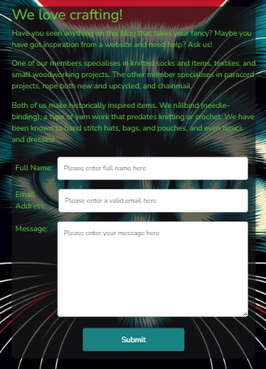

### Admin

The **Admin panel** is one of the most important parts of this site, it is where the clients will be able to enter their posts, and images, monitor user registrations, check any contact requests and reply as needed, monitor and approve or delete comments.

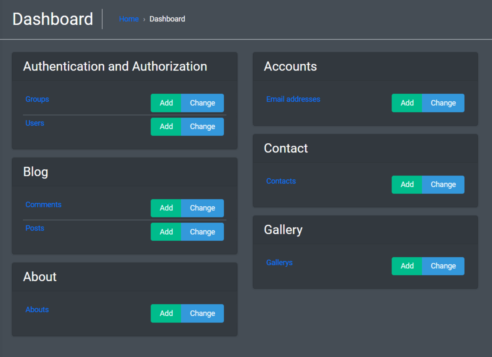

## Stretch goals - future features

***

### Client based stretch goals

- The gallery to auto-populate with images from the gallery posts.
- The gallery images to pop open into larger versions.
- To be able to use hashtags to to catogorise images and posts.
- A search function for posts and tags.

### Developer based

- Further admin panel customisation.
- integrating AI to assist with tags.
- Introducing a mailing list option to assist client.
- Integrate spelling and grammer check into all forms, consider something that isn't grammerly.

## Development

Using a database for this project meant I needed a way to track interactions of database items, to achieve this I used Entity Relationship Diagrams, if I hadn't tracked these things I would have got lost while trying to ensure everything was interacting correctly.

These are the two I have as digital the rest I have scrawled on my notepads:

The **About** section erd

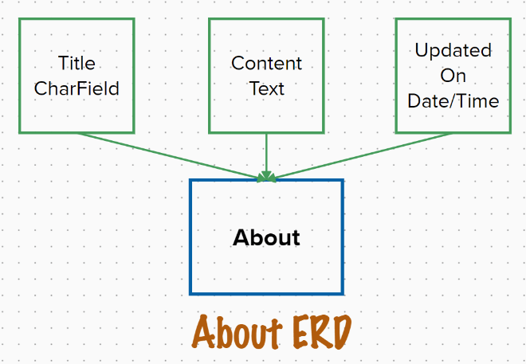

The **blog entry** section erd

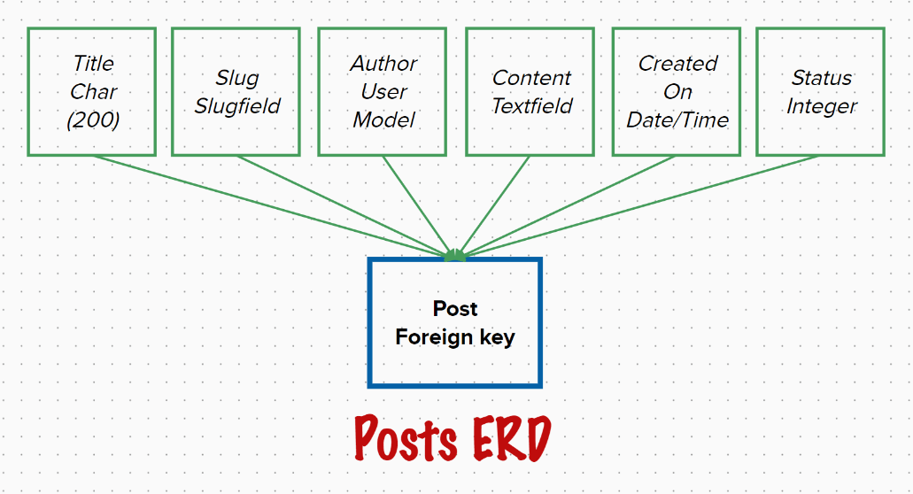

As part of this process I used a kanban board to monitor user stories, and ensure I complete everything the client wanted, with the exception of the 'stretch goals'.  Shown below is a screenshot of the kanban board I created for this project.

| 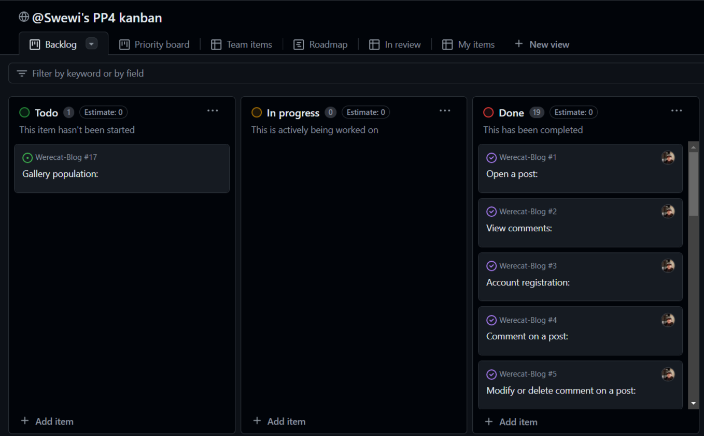 | 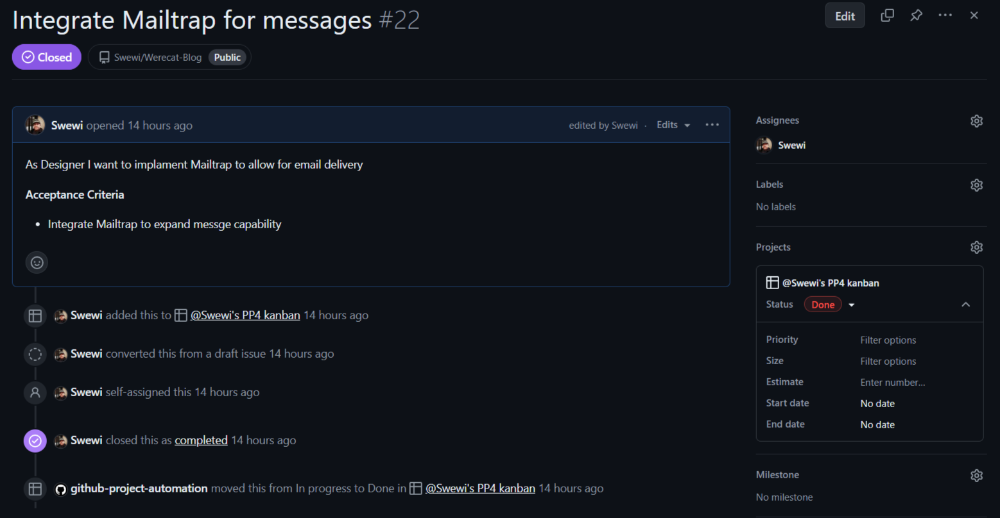 |
|:-------------------------------------------:|:-------------------------------------------:|
| **Kanban board** | **Kanban Issue** |

## Technologies

This is a list of technologies I used while building this site:
***

- Django Framework - version 4.2.13
- Django allauth - version 0.57.2
- Django Crispy forms - version 2.1
- Django Jazzmin - version 3.0.0
- Django Summernote - version 0.8.20.0
- gunicorn - version 20.1.0
- psycopg2 - version 2.9.9
- cloudinary - version 1.36.0
- whitenoise - version 5.3.0
- Bootstrap - version 5.3.x
- pip - version 24.0
- python - for the functionality of the inside gubins of the website.
- HTML  - to accomplish the structure of the website.
- CSS - to style the website.
- Javascript - for the functionality of the user visable website.
- Git - to provide version control (to commit and push code to the repository).
- Gitpod - IDE to develop the website.
- Github - To host the source code.
- Swewi's kanban board - To monitor user stories and track.
- Heroku - Used to deploy the project.
- Google Dev Tools - For page inspection and checking website.
- Code Institute's Gitpod Template - to generate the workspace for the project.
- Mural - to make the ERD's for database interactions.
- [Lorem Ipsum](https://loremipsum.io/) - Creating initial content to check pagination.
- Supabase - to host the postgres database.

This is a list of technologies I used to design this website:
***

- [TechSini](https://techsini.com/multi-mockup/) To create mockup image.
- [TinyJPG](https://tinyjpg.com/) To compress images.
- [FontAwesome](https://fontawesome.com/) Icons.
- [Goggle Fonts](https://fonts.google.com/) For website fonts.
- [Favicon](https://favicon.io/) To create favicon for the website.
- [Open art AI](https://openart.ai/home) To create the background image.
- [ChatGPT](https://chat.openai.com/) used for spell checking, grammar, readability, and creating blog posts.
- [Nimbus Screenshot](https://nimbusweb.me/) used for screenshots
- My own photo's.

This is a list of the technologies I used to help me spell and grammer check, as well as error check code when I ran into issues displaying the gallery:
***

- Stack overflow
- - Nothing specific but helped when I was looking for answers.
- Cloud with Django - youtube channel specifically the 'Host uploaded images from Django with Cloudinary'
- - I hadn't added all the information I needed for cloudinary integration, this chanel helped me see that.
- Code Institute's tutoring service
- - After a restart I had trouble getting the allowed host to stabilise.

This is a list of technologies I used to manually test both the code and the accessability:
***

- [Colorfilter](https://www.toptal.com/designers/colorfilter/) to check website for colour-blind accessibility.
- [NVDA screen reader](https://www.nvaccess.org/) to access screen reader capabilities on website.
- Google Chrome's [Lighthouse](https://developer.chrome.com/docs/lighthouse/overview/) to check accessibility.
- [WAVE Web Accessibility Evaluation Tools](https://wave.webaim.org/) used to spot check individual pages.
- [W3C HTML Markup Validator](https://validator.w3.org/) to check HTML code.
- [W3C Jigsaw CSS Validator](https://jigsaw.w3.org/css-validator/) to check CSS code.
- [ESlint javascript validator](https://eslint.org/) to check javascript code.

## Testing

Please see [TESTING.md](TESTING.md) for all testing data.

## Deployment

### Important point for this project

This is a django project, as such it has been built with the django framework, in order to maintain a level of security for certain variables they stored within a secret file env.py.  This file **IS NOT** stored within the project, it must be recreated if you are starting a new workspace, please ensure you use your own details for this.

## Cloning the Repository

- On Github navigate to the repository "<https://github.com/Swewi/Werecat-Blog/tree/main>"
- Click "Code" drop down menu - a green button shown right above the file list.
- Copy the URL of the repository using "HTTPS", "SSH" or "Github CLI".
- Open Git Bash.
- Change the current working directory to the location where you want the cloned directory.
- Type "git clone", and then paste the URL copied earlier.
- Press enter to create local clone. A clone of the repository will now be created.

- For more details on how to clone the repository in order to create a copy for own use refer to the site:
[Cloning a Repository](https://docs.github.com/en/repositories/creating-and-managing-repositories/cloning-a-repository)

## Forking a Repository

- On Github navigate to the repository "<https://github.com/Swewi/Werecat-Blog/tree/main>"
- Click "Fork" located towards top right corner on GitHub page.
- Select "owner" for the forked repository from the dropdown menu under "owner".
- It will create forked repo under the same name as original by default. But you can type a name in "Repository name" or add a description in "Description" box.
- Click on "Create fork". A forked repo is created.

### Important Information about forking a repository

- Forking allows you to make any changes without affecting original project. You can send the the suggestions by submitting a pull request. Then the Project Owner can review the pull request before accepting the suggestions and merging them.

- When you have fork to a repository, you don't have access to files locally on your device, for getting access you will need to clone the forked repository.
- For more details on how to fork the repo, in order to for example suggest any changes to the project you can:
[Forking a Repository](https://docs.github.com/en/get-started/quickstart/fork-a-repo)

## Deploying the app

- The app is deployed from Heroku using the following steps:
  - Use: pip freeze > requirements.txt to add external libraries to deployed app.
  - Create Heroku account.
  - In the top right, click 'New'.
  - Click 'Create new app'.
  - Give your app a name and select your region from drop down.
  - Click 'Create new app'.
  - Go to 'settings' tab, it's important you do it before deployment.
  - Scroll down to 'config vars' section and add all variables needed:
    - Cloudinary API key and secret, cloud name, and URL.
    - Database URL.
    - Email host, password, user, and port.
    - Secret key.
  - Scroll down to 'Buildpacks' section.
  - Click 'Add buildpack'.
  - Add Python as first dependency and select 'Save changes'.
  - Add node.js as a second dependency and save again (This is settings section done).
  - Select 'Deploy' tab at the top.
  - Select 'Github' from 'Deployment method'.
  - Type the name given to your project in Github and click 'search'.
  - Scroll down and select Manual deployment method.
    - You can also use Auto deployment method to allow the project to update every time you push the code.
  - You can now click to view the app ready and running.

### Important Information about deploying the app

- The web application is displayed and deployed using template provided by Code Institute to test the code.

- For this project I used Manual deployment method to deploy the current state of the branch, every time I pushed the code from Gitpod, and automatic once I was at the stage of testing live site for interactivity.

## Credits

- Code Institute's 'Codestar' project.
- My partner for understanding why I am working at the weekend.
- My mentor Ronan for understanding why stupid questions are asked.
- My Grandmother that passsed away suddenly while I was completing the project.
