# Werecat Blog Testing

Return to [README](README.md).

## Blog Page Testing

I conducted both automated and manual testing for the blog posts/comments page:

### Automated Testing Blog

In total I constructed 21 tests to test the majority of the functions within the Blog, broken down into 3 sections:

| Catagory | Test description | Expected outcome | Notes |
| --- | --- | --- | --- |
| Model Testing: | | | |
| Post Model Testing | | | |
| | test_default_status | Verifies the default status value for a Post is Draft | Pass |
| | test_slug_uniqueness | Ensures that each Post must have a unique slug | Pass |
| | test_featured_image_default | Checks that the default value for featured_image is 'placeholder' | Pass |
| | test_related_name_for_author | Verifies the related_name attribute blog_posts allows access to posts by the author | Pass |
| | test_ordering | Ensures Post instances are ordered by created_on in descending order | Pass |
| | test_slug_generation | Confirms that the slug is automatically generated based on the title if not provided | Pass |
| Comment Model Testing | | | |
| | test_comment_ordering | Verifies that comments are ordered by created_on in ascending order | Pass |
| | test_related_name_for_post_comments | Checks that the related_name attribute comments allows access to comments on a post | Pass |
| | test_related_name_for_author_comments | Ensures that the related_name attribute comments_author allows access to comments authored by a specific user | Pass |
| | | | |
| Form Testing: | | | |
| Test Comment Form | | | |
| | test_form_is_valid | Checks that the form is valid when a non-empty comment body is provided | Pass |
| | test_form_is_invalid | Ensures the form is invalid when the comment body is empty | Pass |
| | | | |
| View Testing: | | | |
| Post Detail and List Views | | | |
| | test_render_post_detail_page_with_comment_form | Verifies that the post_detail view renders the post with the comment form | Pass |
| | test_post_list_page | Ensures that the home view (post list) loads correctly and displays posts | Pass |
| | test_post_list_pagination | Tests pagination on the post list page | Pass |
| | test_post_detail_with_non_existent_slug | Verifies that accessing a post with a non-existent slug returns a 404 error | Pass |
| | | | |
| Comment Submission and Editing | | | |
| | test_successful_comment_submission | Verifies that a logged-in user can successfully submit a comment | Pass |
| | test_comment_submission_without_login | Ensures that unauthenticated users cannot submit comments and are redirected to the login page | Pass |
| | test_comment_edit | Checks that a user can edit their own comment | Pass |
| | test_comment_edit_by_different_user | Ensures that a user cannot edit another user's comment | Pass |
| Comment Deletion | | | |
| | test_comment_deletion | Verifies that a user can delete their own comment | Pass |
| | test_comment_deletion_by_different_user | Ensures that a user cannot delete another user's comment | Pass |

---

| 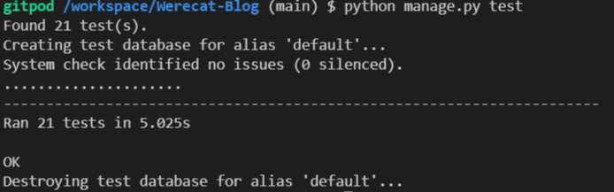 | 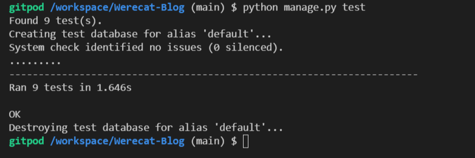 |
|:-------------------------------------------:|:-------------------------------------------:|
| **Overall Blog Test output** | **Blog Model Test Output** |
| 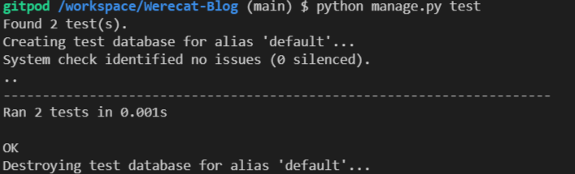 |  |
| **Blog Form Test Output** | **Blog View Test Output** |

### Manual Testing Blog

| Status | Test | Expected Result | Notes |
| --- | --- | --- | --- |
| Logged Out | Click on logo or 'Home' | Redirect to the homepage/blog page | Pass |
| | Click on a post | Opens the post to full page for easy reading | Pass |
| | Trying to interact with the comments | No options available, but msg pointing out login/register to interact | Pass |
| | | | |
| Logged In | Trying to interact with comments | Can add a comment to blog post | Pass |
| | Clicking the 'edit' button on your comment/s | Opens the comment to allow for editing | Pass |
| | Clicking the 'delete' button on your comment/s | Opens warning for deletion | Pass |
| | Interacting with someone elses comment | No options available | Pass |

---

| 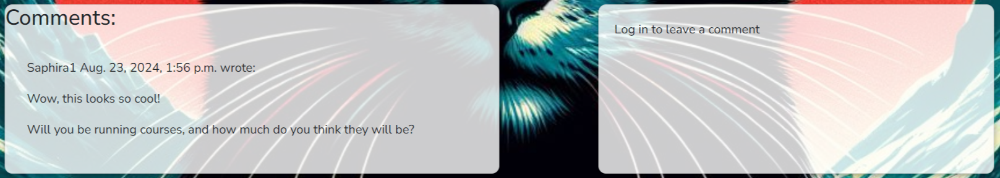 | 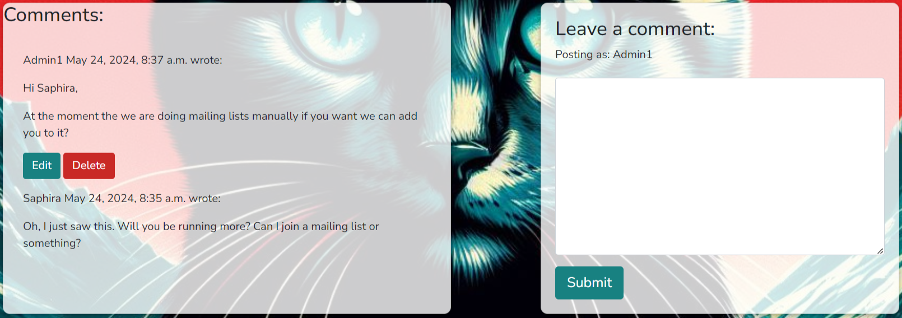 |
|:-------------------------------------------:|:-------------------------------------------:|
| **Not logged in user** | **Logged in user** |
| 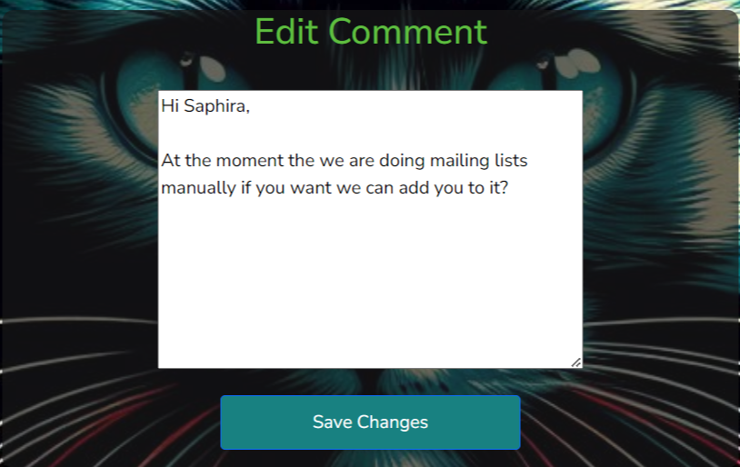 | 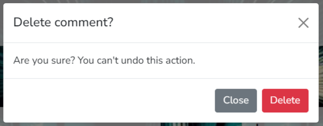 |
| **Editable by logged in user** | **Deletable by logged in user** |

## Gallery Page Testing

I conducted both automated and manual testing for the gallery page:

### Automated Testing Gallery

In total I constructed 8 tests to test the majority of the functions within the Gallery, broken down into 2 sections:

| Catagory | Test description | Expected outcome | Notes |
| --- | --- | --- | --- |
| Model Testing: | | | |
| Gallery Model Attribute Tests | | | |
| | test_gallery_attributes | Ensure that the attributes are correctly set when an instance is created | Pass |
| | test_gallery_image_accepts_none | Confirm that the gallery_image field can be set to None | Pass |
| | test_save_gallery | Test that an object is saved correctly and  verify the count in the database is updated | Pass |
| | | | |
| Veiw Testing: | | | |
| | test_gallery_view_status_code | Ensure that the gallery view returns a 200 status code | Pass |
| | test_gallery_view_template | Verify that the gallery view uses the correct template | Pass |
| | test_gallery_view_context | Check if the context passed to the gallery view contains the expected keys | Pass |
| | test_gallery_view_items | Test that gallery items are displayed correctly in the view | Pass |
| | test_gallery_view_image_urls | Verify that image URLs for items are correctly included in the view's response | Pass |

---

|  |  |
|:-------------------------------------------:|:-------------------------------------------:|
| **Overall Gallery Test output** | **Gallery Model Test Output** |
| 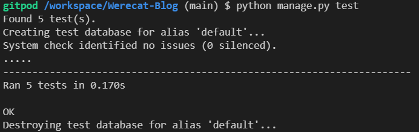 | |
| **Gallery View Test Output** | |

### Manual Testing Gallery

| Status | Test | Expected Results | Notes |
| --- | --- | --- | --- |
| Logged out or in | Click on Gallery | Be redirected to the gallery page | Pass |
| | Carousel of images scrolls automatically | Watch the images scroll past | Pass |
| | Forwards/backwards keys on carousel for manual over-ride | Click the forward or back arrows to move to a new page/previous page | Pass |

## About Page Testing

I conducted both automated and manual testing for the about page:

### Automated Testing About

In total I constructed 2 tests to test the About Page, broken down into 2 sections:

| Catagory | Test description | Expected outcome | Notes |
| --- | --- | --- | --- |
| Model Testing: | | | |
| | setUp | PPrepares the necessary About instance for testing | Pass |
| | | | |
| Veiw Testing: | | | |
| | test_about_view | Ensures the about view correctly returns a 200 status code and includes the expected content | Pass |

---

| 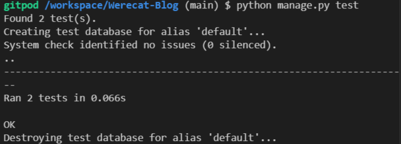 |  |
|:-------------------------------------------:|:-------------------------------------------:|
| **Overall About Test output** | **About Model Test Output** |
| 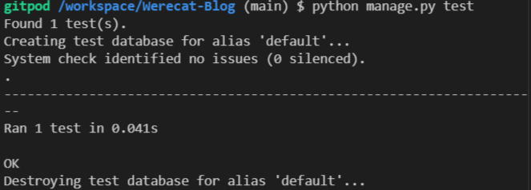 | |
| **About View Test Output** | |

### Manual Testing About

| Status | Test | Expected Results | Notes |
| --- | --- | --- | --- |
| Logged out or in | Click on About | Be redirected to the about page | Pass |

## Contact Page Testing

I conducted both automated and manual testing for the Contact page:

### Automated Testing Contact

In total I constructed 16 tests to test the majority of the functions within the Contact Page, broken down into 3 sections:

| Catagory | Test description | Expected outcome | Notes |
| --- | --- | --- | --- |
| Model Testing: | | | |
| | test_create_contact | verifies that a Contact instance can be created and verified successfully | Pass |
| | test_str_representation | ensures that the string representation is formatted correctly | Pass |
| | test_blank_name_and_message | checks behavior of model when the name/message fields are blank | Pass |
| | test_email_validation | validates if email field is correctly checked by validation | Pass |
| | test_default_read_status | confirms the default value for read is set correctly | Pass |
| | test_update_read_status | verifies the read status can be updated and saved correctly | Pass |
| | | | |
| Views Testing: | | | |
| | test_form_is_valid | checks if form is valid when all required fields are correct | Pass |
| | test_name_is_required | verifies the form correctly checks the requirement for name field | Pass |
| | test_email_is_required | ensures the form correctly checks the requirement for email field | Pass |
| | test_message_is_required | verifies the form correctly checks the requirement for message field | Pass |
| | | | |
|  Form Testing: | | | |
| | test_form_fields | ensures the form contains only expected fields | Pass |
| | test_form_is_valid | checks the form is valid when all required fields are provided with appropriate data | Pass |
| | test_name_field | validates name field, checking correct handling of empty and excessively long input | Pass |
| | test_email_field | validation rules for email field, including required and format | Pass |
| | test_message_field | validates message field, including required input type | Pass |
| | test_form_widgets | checks that correct widgets are used for each field in the form | Pass |

---

| 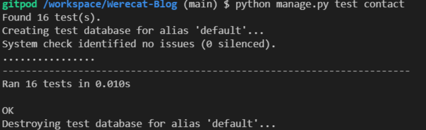 | 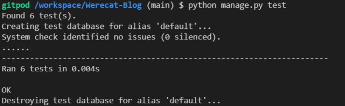 |
|:-------------------------------------------:|:-------------------------------------------:|
| **Overall Contact Test output** | **Contact Model Test Output** |
| 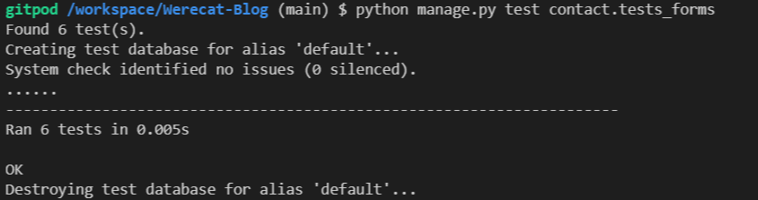 | 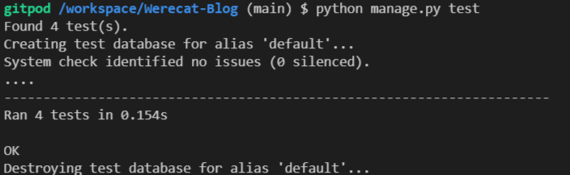 |
| **Contact Form Test Output** | **Contact View Test Output** |

### Manual Testing Contact

| Status | Test | Expected Results | Notes |
| --- | --- | --- | --- |
| Logged out or in | Click on Contact | Redirects to Contact Form | Pass |
| | All fields entered correctly | Mail sent successfully to Admin address | Pass |
| | Missing name | Alert pops up and can't submit message | Pass |
| | Missing email | Alert pops up and can't submit message | Pass |
| | Missing message | Alert pops up and can't submit message | Pass |

| 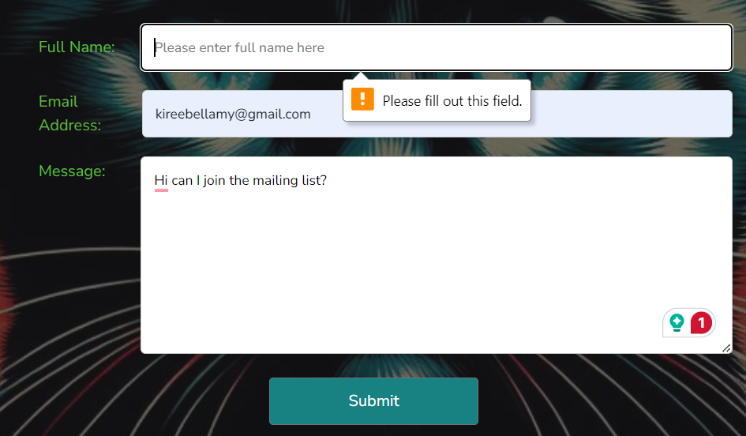 | 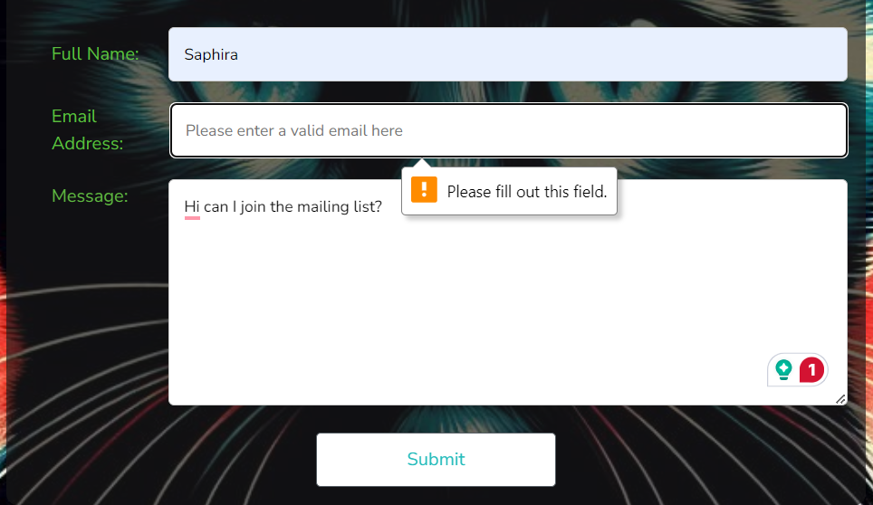 |
|:-------------------------------------------:|:-------------------------------------------:|
| **Missing name** | **Missing email** |
| 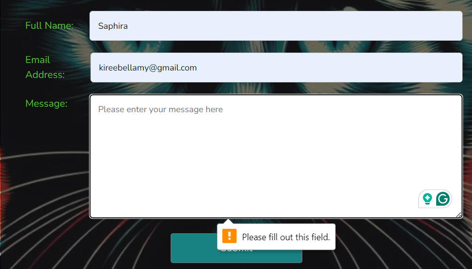 | |
| **Missing message** | |

## Non-page specific Manual testing

| Catagory | Status | Test | Expected Results | Notes|
| --- | --- | --- | --- | --- |
| User | Not logged-in | Click on logo or Home Page | Can view/interact with Home/Blog page | Pass |
| | | Click on Gallery | Can view/interact with Gallery Page | Pass |
| | | Click on About | Can view/interact with About Page | Pass |
| | | Click on Contact | Can view/interact with Contact form | Pass |
| | | Click on a blog post | Be able to read the blog post as a full screen | Pass |
| | | Click on Register | Can register an account | Pass |
| | | Click on Login | Can login to a previously registered account | Pass |
| | Logged-in | Click on a blog-post | Can create/edit/delete your comments | Pass |
| | | Click on username dropdown | Have the ability to logout of account | Pass |
| | | | | |
| Admin | Logged-in | Click on the Admin Panel button | Gains access to the Admin panel and all associated functionality | Pass |
| | | Create post or gallery item from admin panel | Click add a new post or gallery item and have it display | Pass |
| | | Click 'Werecat Blog' in admin panel | Will return you to Home Page | Pass |

---

While testing `gallery` I had a problem with the cloudinary path, I double and triple checked the path within env.py, settings.py, and both URLs.py, and genuinely wondered why everything was working while I was manually testing things.  Checked everything on the cloudinary site made sure all the details were the same as the env.py.  Again wondering why the manual testing and deployment had worked.  Went back to the tests_views.py and scrolled through each line carefully and found a spelling mistake in this line:

self.assertTemplateUsed(response, 'gallery/gallery.html')

Once corrected the tests passed.

## Code Validators

### HTML Validation

I have tested several pages of the app to check if the HTML passes the W3C Markup Validation Service, other than a random hanging `div` that had been missed when fixing something, the other issue I had was miss used aria-labelledby that I went through and corrected.

| 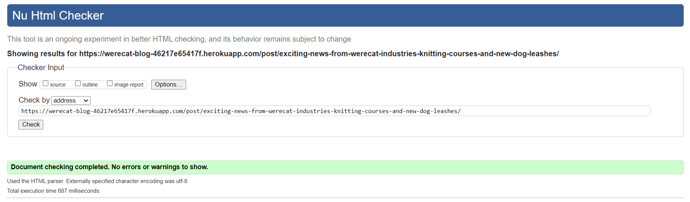 | 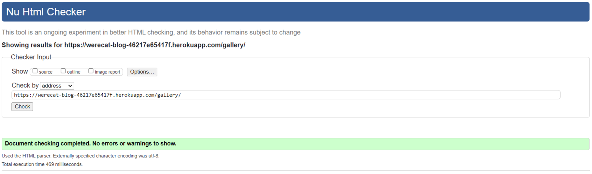 |
|:-------------------------------------------:|:-------------------------------------------:|
| **Validator result for blog post** | **Validator result for gallery page** |
| 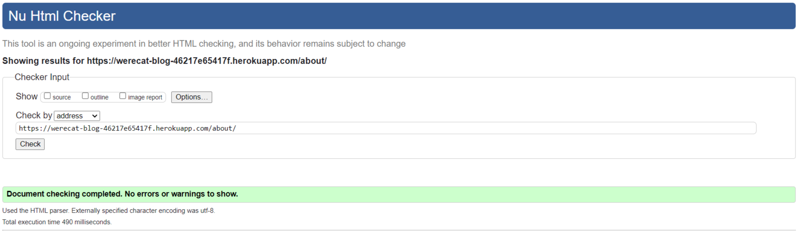 | 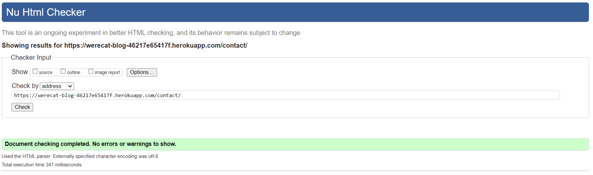 |
| **Validator result for about page** | **Validator result for contact form** |

While testing the pagination of the blog posts I have run into a single warning:

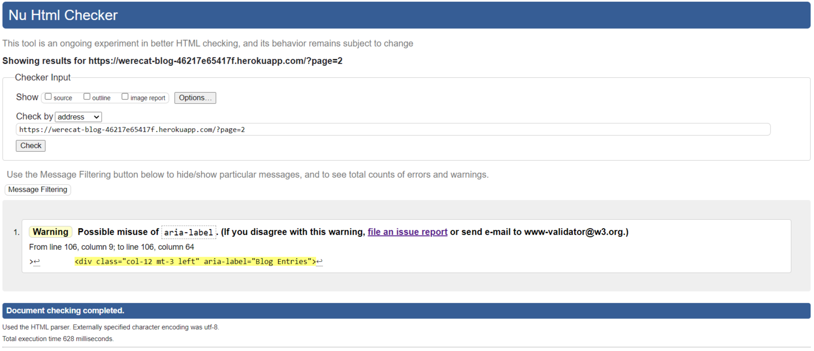

I have submitted a report because I feel like this is an acceptable usage of **aria-label**

### CSS Validation

I have run the style.css through the W3C CSS Validation Service, there were no problems.

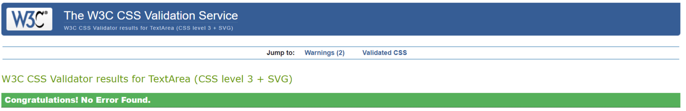

### Javascript Validator

I have used ESlint to check the .js files used across the site, there were no problems.

## Browser Testing

I tested four of the most commonly used browsers:

- Google Chrome
  - I have opened every page from every other page, all the links worked.
  - I have used dev-tools to test image links and alt tags, all showed correctly.
  - I have tested all the links on the external links page, making sure they conected correctly, all links worked correctly.

- Opera GX
  - I have opened every page from every other page, all the links worked.
  - I have used dev-tools to test image links and alt tags, all showed correctly.
  - I have tested all the links on the external links page, making sure they conected correectly, all links worked correctly.

- Mozilla Firefox
  - I have opened every page from every other page, all the links worked.
  - I have used dev-tools to test image links and alt tags, all showed correctly.
  - I have tested all the links on the external links page, making sure they conected correectly, all links worked correctly.

- Edge
  - I have opened every page from every other page, all the links worked.
  - I have used dev-tools to test image links and alt tags, all showed correctly.
  - I have tested all the links on the external links page, making sure they conected correectly, all links worked correctly.

## Accessibility

In order to test the accessibility of the site I run the site through the following tests:

### Colourblind and low vision testing

- - [Red/Green - red cone based](https://www.toptal.com/designers/colorfilter?orig_uri=https://werecat-blog-46217e65417f.herokuapp.com/&process_type=protan)
- - [Red/Green - green cone based](https://www.toptal.com/designers/colorfilter?orig_uri=https://werecat-blog-46217e65417f.herokuapp.com/&process_type=deutan)
- - [Blue/Yellow - blue cone based](https://www.toptal.com/designers/colorfilter?orig_uri=https://werecat-blog-46217e65417f.herokuapp.com/&process_type=tritan)
- - [Greyscale](https://www.toptal.com/designers/colorfilter?orig_uri=https://werecat-blog-46217e65417f.herokuapp.com/&process_type=grey)
- NVDA screen reader: While using this program I had no problem understanding what was being said, and it was clearly reading extra information.
- Aria/Alt: Used throughout the site to maximise readabilty by screen readers.

### Wave output

I used WAVE to spot check each page, and get a detailed rundown of any accessibility issues, these were then fixed and rechecked, while doing this I discovered missing links, redundant links, low contrast, and a repeated warning with lack of subheadings.

| 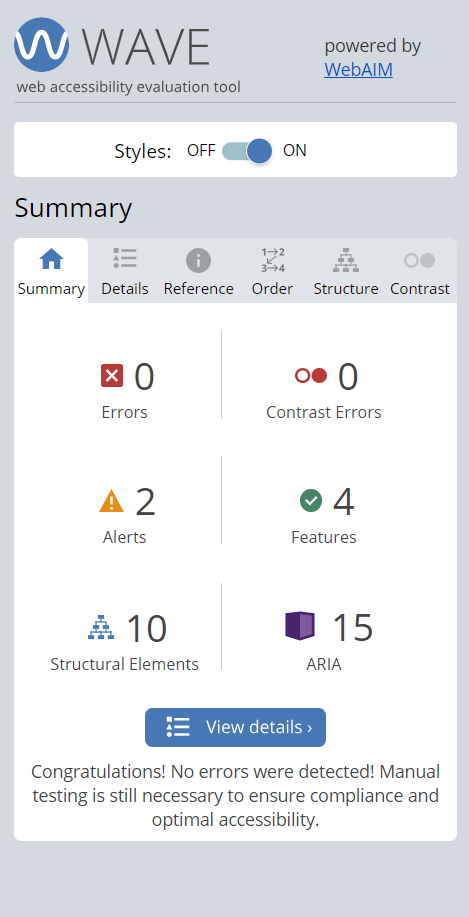 | 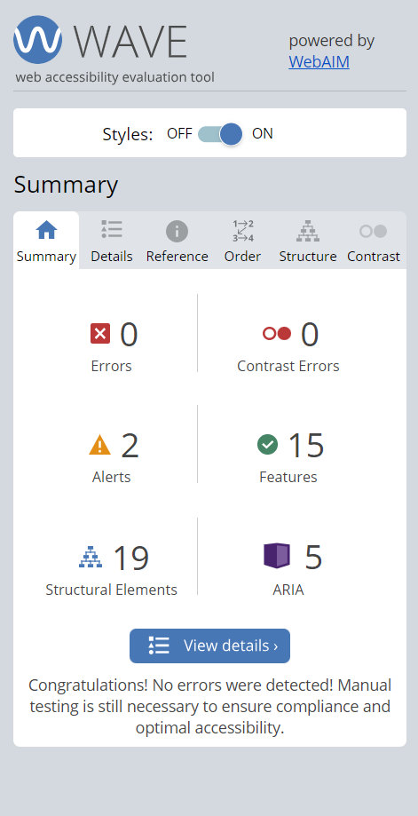 | 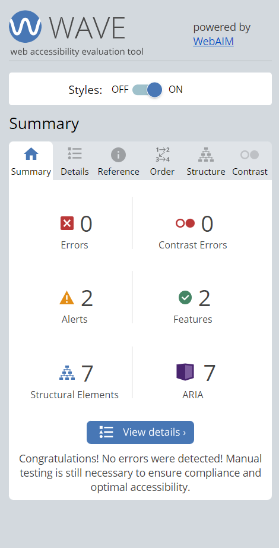 | 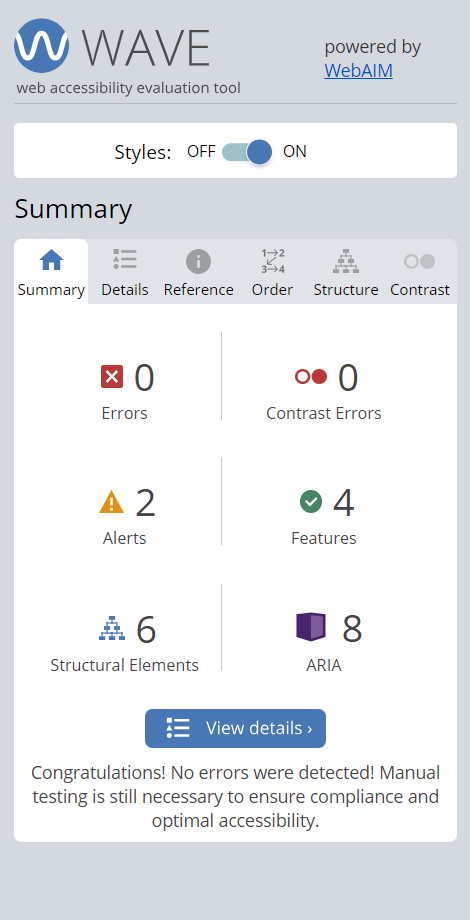 |
|:-------------------------------------------:|:-------------------------------------------:| :-------------------------------------------:|:-------------------------------------------:|
| **WAVE output for home page** | **WAVE output for gallery page** | **WAVE output for about page** | **WAVE output for contact page** |
| 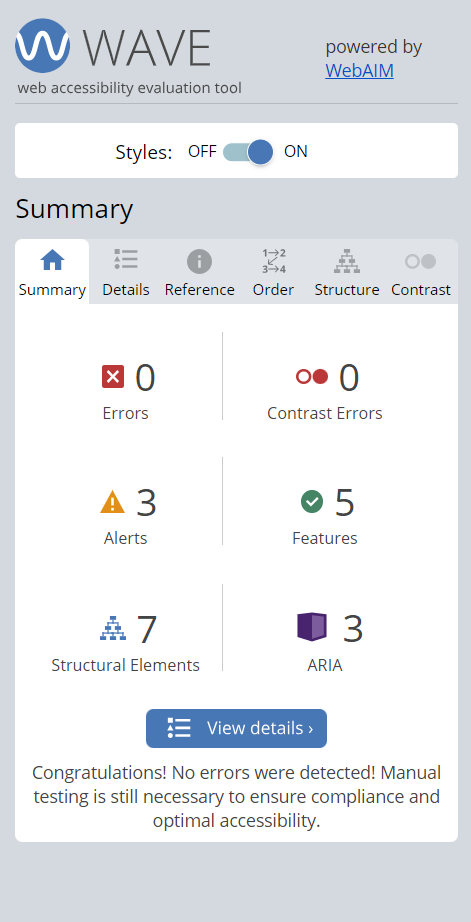 | 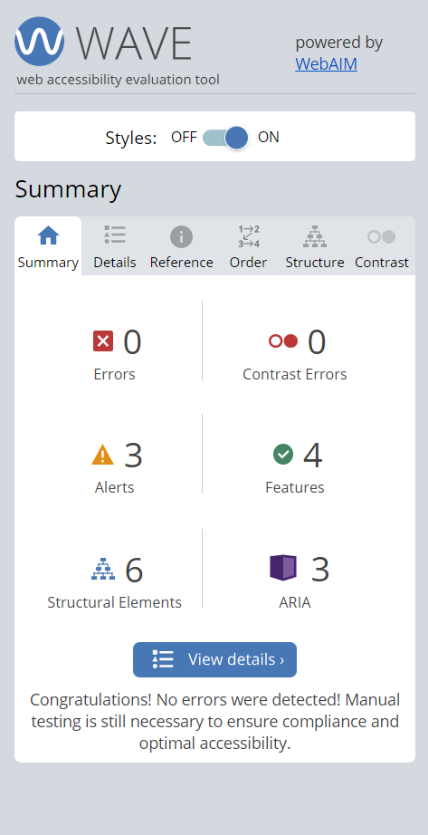 | 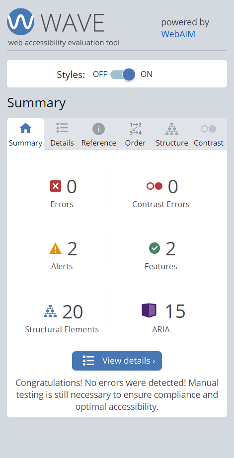 | |
 | **WAVE output for register page** | **WAVE output for login form** | **WAVE output for blog post** | |

### Lighthouse output

I ran lighthouse to check the overall accessibility rating of the website, the results below are for both a desktop and a mobile device:

#### Desktop

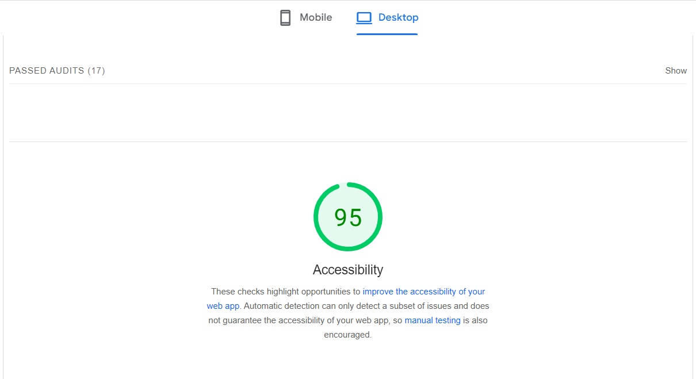

#### Mobile

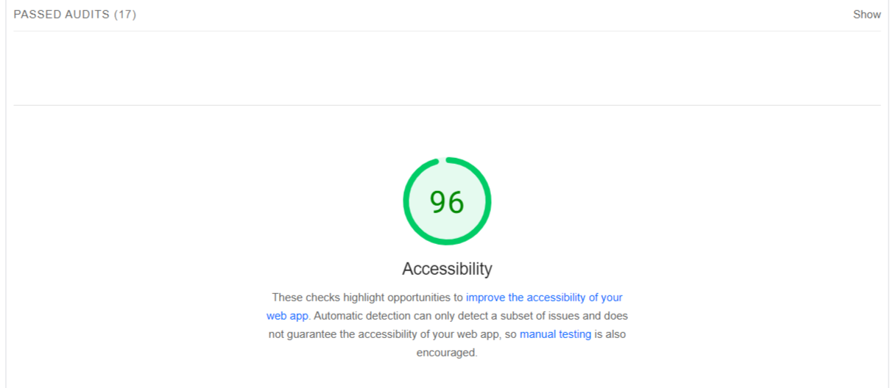

Overall the accessibilitiy of the site is good.

Return to [README](README.md).
